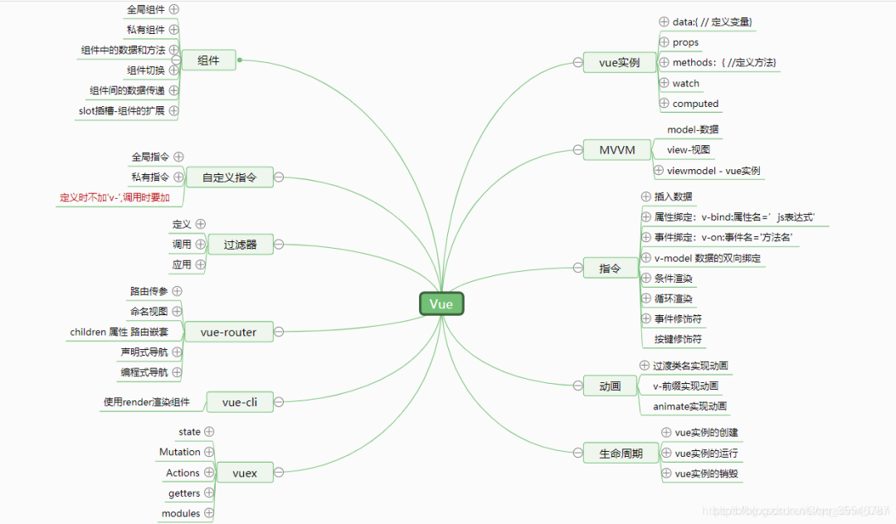
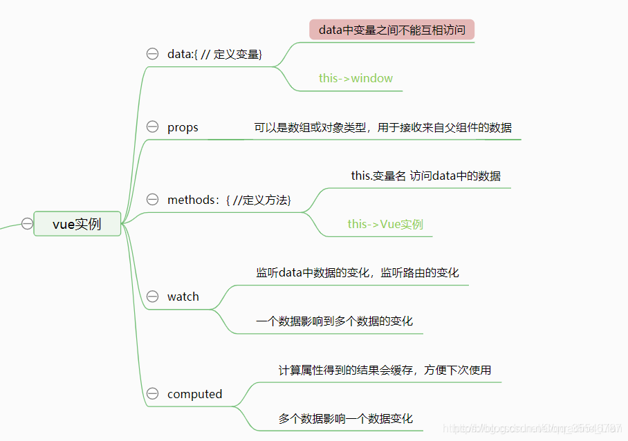
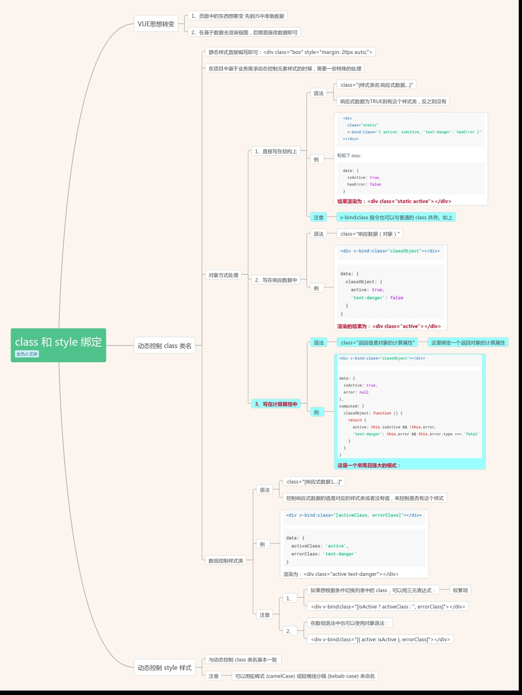
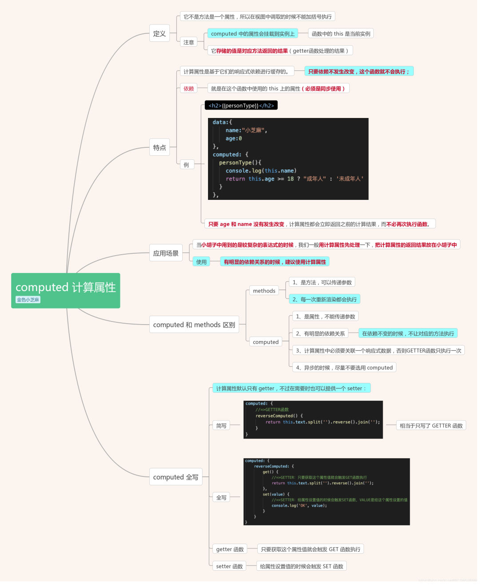
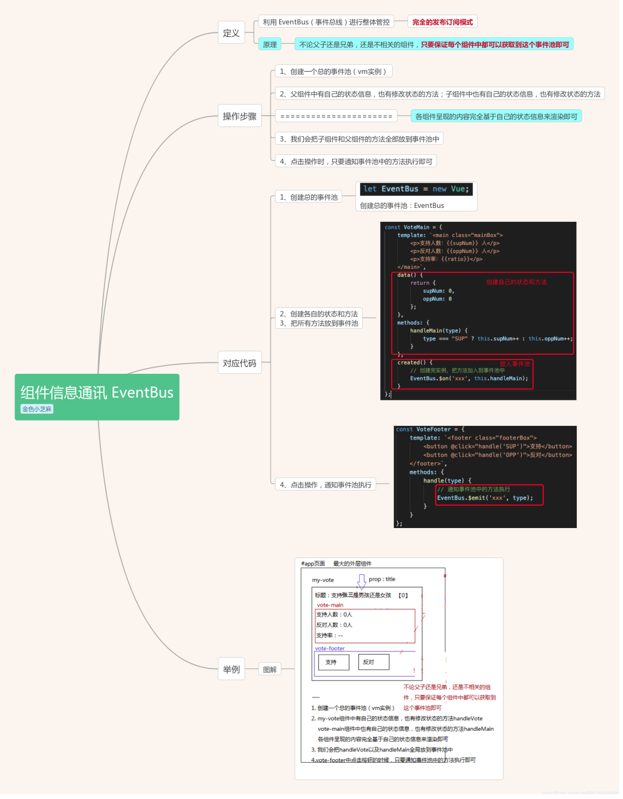
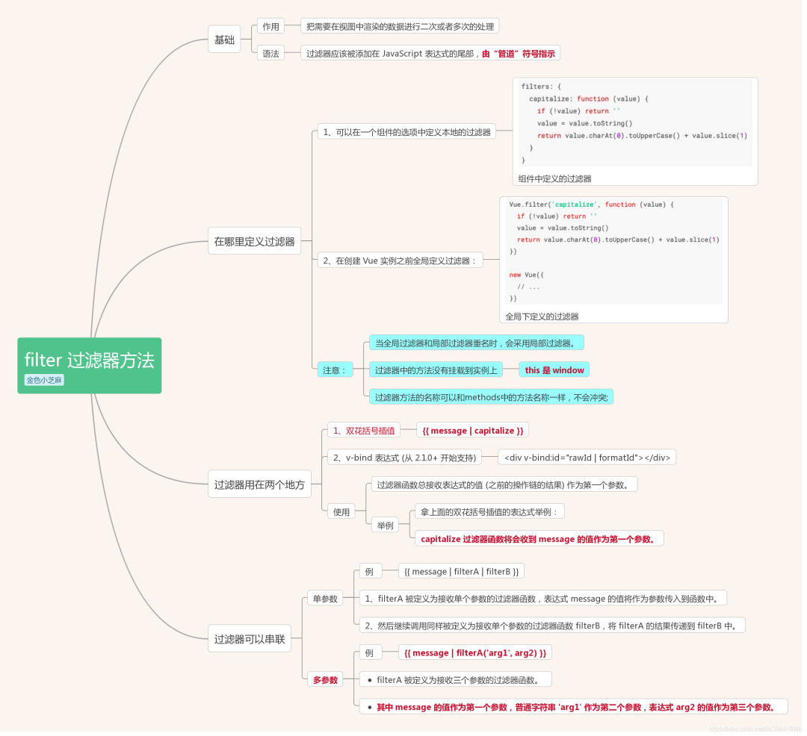

# vue知识点思维导图

转载整理自：https://cloud.tencent.com/developer/article/1692379

`Vue`是一套构建用户界面的框架，只关注视图层，它不仅易于上手，还便于与第三方库或既有项目整合。（`Vue`有配套的第三方类库，可以整合起来做大型项目的开发）



## 1. MVC与MVVM的区别

-   `MVC`是后端的分层开发概念；
-   `MVVM`是前端视图层的概念，主要关注于 **视图层分离**。`MVVM`把前端的视图层分为了三部分：`Model`,`View`,`VM ViewModel`

## 2. vue基本代码结构



```js
const vm = new Vue({
 el:'#app',//所有的挂载元素会被 Vue 生成的 DOM 替换
 data:{ // this->window },
 methods:{ // this->vm},
 //注意，不应该使用箭头函数来定义 method 函数 ,this将不再指向vm实例
 props:{} ,// 可以是数组或对象类型，用于接收来自父组件的数据
 //对象允许配置高级选项，如类型检测、自定义验证和设置默认值
 watch:{ // this->vm},
 computed:{},
 render(){},
 // 声明周期钩子函数
})
```

当一个`Vue`实例被创建时，它将`data`对象中的所有的`property`加入到`Vue`的响应式系统中。当这些`property`的值发生改变时，视图将会产生 **响应**，即匹配更新为新的值。

例外：

-   `Vue`实例外部新增的属性改变时不会更新视图。
-   `Object.freeze()`，会阻止修改现有的`property`，响应系统无法追踪其变化。

### 2.1 实例属性和方法

-   访问`el`属性：`vm.$el`,`document.getElemnetById(‘app’)``;
-   访问`data`属性：`vm.$data`
-   以_或开头的property不会被Vue实例代理，因为它们可能和Vue内置的property、API方法冲突。你可以使用例如vm.data._property的方式访问这些property。
-   访问`data`中定义的变量：`vm.a`,`vm.$data.a`
-   访问`methods`中的方法：`vm.方法名()`
-   访问`watch`方法：`vm.$watch()`

不要在选项`property`或回调上使用箭头函数,`this`将不会指向`Vue`实例 比如`created: () => console.log(this.a)`或`vm.$watch('a', newValue => this.myMethod())`。

因为箭头函数并没有`this`，`this`会作为变量一直向上级词法作用域查找，直至找到为止，经常导致`Uncaught TypeError: Cannot read property of undefined`或`Uncaught TypeError: this.myMethod is not a function`之类的错误。

## 3. vue指令


**插入数据：**

-   插值表达式相当于占位符，不会清空元素中的其他内容。直接写在标签中。会将`html`标签作为文本显示。
-   `v-text`会覆盖元素中原本的内容。写在开始标签中，以属性的形式存在。会将`html`标签作为文本显示。
-   `v-html（innerHTML）`会覆盖元素中原本的内容，会将数据解析成`html`标签。


## 4. vue组件


### 4.1  **组件配置对象和vue实例的区别**

-   组件配置对象没有`el`，组件模板定义在`template`中；
-   组件配置对象中`data`是函数，该函数返回的对象作为数据。

### 4.2 创建组件模板

-   方法一

```javascript
var com = Vue.extend({
 //通过template属性 指定组件要展示的html结构
 template:'<h3>这是使用Vue.extend搭建的全局组件</h3>' 
})
```

-   方法二：使用对象创建模板

```javascript
{
 template:'<h3>这是使用Vue.extend搭建的全局组件-com3</h3>'      
}
```

-   方法三：使用`template`标签（写在受控区域外面）创建模板，通过`id`建立联系

```javascript
<template id="tmpl"> 写在受控区域外面
  ......
</template> 

{ template:'#tmpl'  }
```

### 4.3 组件中的data是一个函数的原因

-   多次使用该组件，如果修改其中一个中的数据，另一个也会改变。
-   写成函数的形式，每次调用函数，返回一个新的对象

### 4.4 ref属性

-   获取`dom`元素/组件：标签上添加`ref`属性，`this.$refs.ref`属性值获取该`dom元素/组件`。
-   `this.$refs.ref`属性值`.变量名`获取组件中的数据
-   `this.$refs.ref`属性值`.方法名()`获取组件中的方法

##### **`$parent` 和 `$children` 获取 父/子组件的数据和方法**

-   `this.$parent`获取父组件
-   `$children`由于子组件的个数不确定 返回的是一个数组 ,不是对象
-   `this.$children[0]`获取第一个子组件

### 4.5 作用域插槽：父组件替换插槽的标签，内容由子组件决定

>   编译的作用域：自身的数据在自身模板`template`标签中生效

-   插槽上添加 **属性绑定**：`data=’子组件中的数据’`
-   父组件通过`template`标签，添加`slot-scope=’slot’` `slot-scope`属性接收子组件中的数据`slot.data`
-   `template`标签中的html结构替换`slot`插槽中的默认`html`结构。

## 5. class和style动态绑定




## 6. computed 计算属性



## 7. EventBus




## 8. filter过滤器方法



https://zhuanlan.zhihu.com/p/269766611